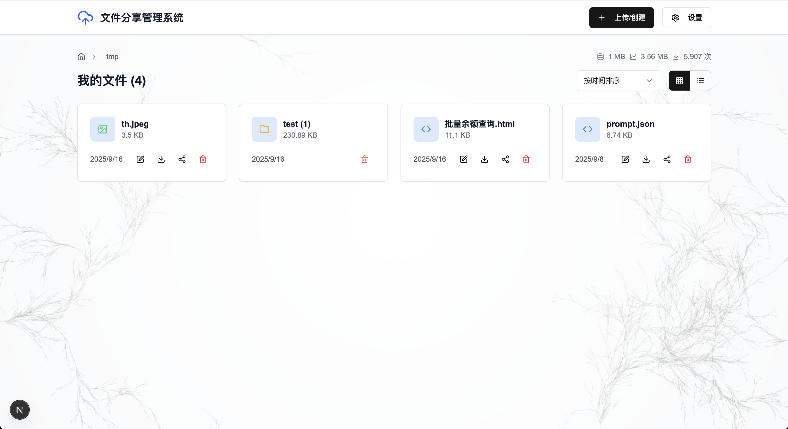
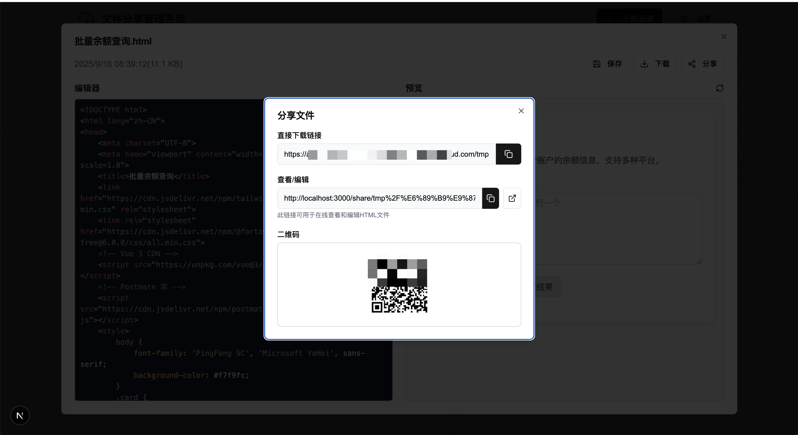
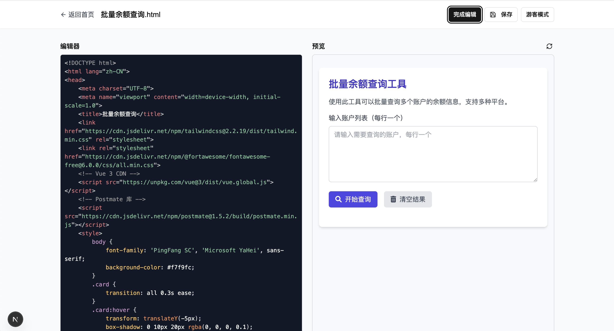

# HTML2Web - 基于 Next.js 和腾讯云 COS 的文件管理器

这是一个功能完善、界面现代的 Web 文件管理器。它使用 Next.js 构建，并深度集成了腾讯云对象存储（COS），为您提供了一个私有、高效、可扩展的云存储解决方案，同时支持 Restful 接口层级调用。



<details>
<summary>编辑器截图</summary>


</details>

<details>
<summary>接口调用格式</summary>

```javascript
/**
 * GET/POST/DELETE /api/cos/files/[...key]
 * - To list contents: ?type=folder
 * - To download a file: ?type=file (or omit type)
 * - header Authorization: your_token
 */

/**
 * GET /api/static/[...file]
 * - To get a file
 */
```
</details>

## ✨ 主要功能

- **文件和文件夹管理**: 支持完整的 CRUD (创建、读取、删除) 操作。
- **文件上传**: 支持复制链接/文件、拖拽上传和选择文件上传。
- **文件下载**: 单文件下载和多文件打包下载。
- **在线预览**: 支持图片、文本等常见文件类型的在线预览。
- **文件分享**: 生成文件的分享链接，可设置有效期和密码(待定)。
- **响应式设计**: 在桌面和移动设备上均有良好的使用体验。
- **可配置性**: 通过环境变量轻松配置腾讯云 COS 信息。
- **调用统计**: 支持调用统计，可查看调用次数和调用时间。

## 🚀 技术栈

- **前端框架**: [Next.js](https://nextjs.org/) (React)
- **UI 组件库**: [shadcn/ui](https://ui.shadcn.com/)
- **样式**: [Tailwind CSS](https://tailwindcss.com/)
- **状态管理**: React Hooks + Context API
- **后端存储**: [腾讯云对象存储 (COS)](https://cloud.tencent.com/product/cos)
- **语言**: [TypeScript](https://www.typescriptlang.org/)

## 🛠️ 快速开始

请按照以下步骤在本地运行此项目。

### 1. 环境准备

- [Node.js](https://nodejs.org/) (>= 18.x)
- [Yarn](https://yarnpkg.com/) 或 npm/pnpm
- 一个已开通的腾讯云账号，并创建好一个 COS 存储桶 (Bucket)。

### 2. 克隆项目

```bash
git clone https://github.com/Asn-Zz/html2web.git
cd html2web
```

### 3. 安装依赖

```bash
yarn install
# 或者使用 npm
# npm install
```

### 4. 配置环境变量

在项目根目录下创建一个名为 `.env.local` 的文件，并填入您的腾讯云 COS 配置信息。

```plaintext
# .env.local

# 腾讯云密钥 (Tencent Cloud Credentials)
# 建议使用子账号密钥，并授予 COS 的相关权限
# 访问 https://console.cloud.tencent.com/cam/capi 获取
NEXT_PUBLIC_COS_SECRET_ID=your_secret_id
NEXT_PUBLIC_COS_SECRET_KEY=your_secret_key

# 腾讯云 COS 配置 (Tencent Cloud COS Configuration)
# 存储桶名称，格式如: my-bucket-1250000000
NEXT_PUBLIC_COS_BUCKET=your_bucket_name
# 存储桶所在地域，格式如: ap-guangzhou
NEXT_PUBLIC_COS_REGION=your_bucket_region
# 存储桶访问域名前缀，格式如: https://my-bucket-1250000000.cos.ap-guangzhou.myqcloud.com
NEXT_PUBLIC_COS_URL_PREFIX=your_bucket_url_prefix

# 权限令牌 (Token)
# 用于文件上传和下载时的权限验证
# 建议设置一个复杂的随机字符串
NEXT_PUBLIC_TOKEN=your_token
```

> **重要**: 环境变量的名称必须与代码 (`lib/cos-node.ts` 和 `lib/cos-service.ts`) 中使用的名称一致。请在启动前进行确认。

### 5. 运行开发服务器

```bash
yarn dev
```

现在，在浏览器中打开 [http://localhost:3000](http://localhost:3000) 即可看到正在运行的应用。

## 📂 项目结构

```
.
├── app/                # Next.js App Router, 包含页面和 API 路由
│   ├── api/            # 后端 API 接口
│   │   ├── cos/        # COS 服务端操作接口
│   │   └── cos-proxy/  # COS 前端代理接口
│   └── share/          # 文件分享页面
├── components/         # 可复用的 React 组件
│   ├── file-manager/   # 文件管理器的核心组件
│   └── ui/             # shadcn/ui 基础组件
├── lib/                # 核心工具函数和类
│   ├── cos-node.ts     # 服务端 COS SDK 封装
│   ├── cos-service.ts  # 客户端 COS SDK 封装
│   └── utils.ts        # 通用工具函数
├── public/             # 静态资源
└── ...
```

##🤝 贡献

欢迎任何形式的贡献！如果您有任何建议或发现任何问题，请随时提交 Pull Request 或创建 Issue。
